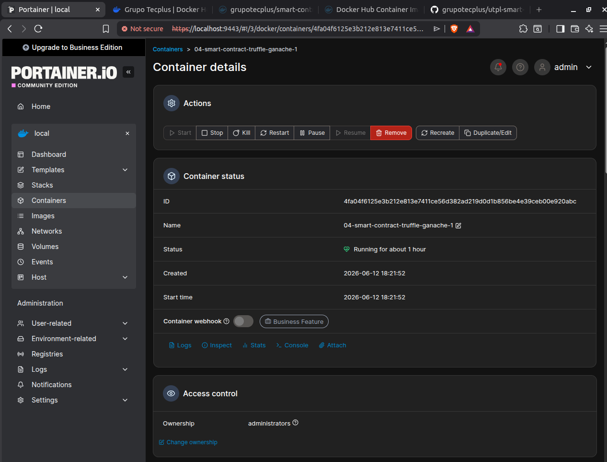

# Tarea: Implementación inicial de smart contract en contenedor Docker

## Resultado de aprendizaje

Implementar técnicas de contenedores y orquestación, prácticas de DevOps, servicios en la nube, arquitecturas serverless y Kubernetes, utilizando estos conocimientos para mejorar la eficiencia y escalabilidad de las aplicaciones.

## Descripción

Este proyecto corresponde a la actividad "Implementación inicial de smart contract en contenedor Docker". Se desarrolló un smart contract básico en Solidity utilizando Truffle y Ganache, el cual fue empaquetado en una imagen Docker y publicado en Docker Hub.

El repositorio incluye:

* Dockerfile para la construcción de la imagen.
* Código fuente del smart contract.
* Configuración de Docker Compose para Ganache y Truffle.
* Scripts de despliegue e interacción.
* Pruebas automatizadas del contrato.

## Contrato

`contracts/HolaUTPL.sol` permite:

* Consultar el mensaje público `mensaje`.
* Actualizar el mensaje almacenado en el contrato.
* Verificar la interacción con la blockchain local mediante Ganache.

## Comandos de ejecución

Levantar Ganache:

```bash
docker compose up -d ganache
```

Compilar:

```bash
docker compose run --rm truffle npx truffle compile
```

Ejecutar pruebas:

```bash
docker compose run --rm truffle npx truffle test
```

Desplegar contrato:

```bash
docker compose run --rm truffle npx truffle migrate --network development
```

Interactuar con el contrato:

```bash
docker compose run --rm truffle npx truffle exec scripts/interact.js --network development
```

Detener servicios:

```bash
docker compose down
```

## Imagen Docker Hub

Construir imagen:

```bash
docker build -t grupotecplus/smart-contract-truffle-docker:1.0.0 .
```

Publicar imagen:

```bash
docker push grupotecplus/smart-contract-truffle-docker:1.0.0
```

## Evidencia de ejecución en Portainer

Se muestra el contenedor de Ganache ejecutándose correctamente en Docker.


